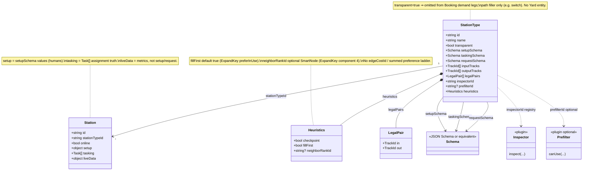
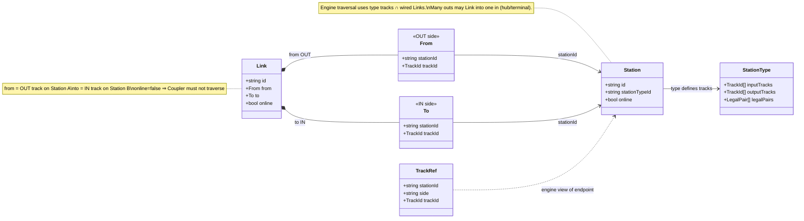
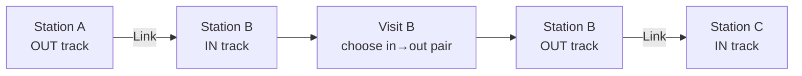
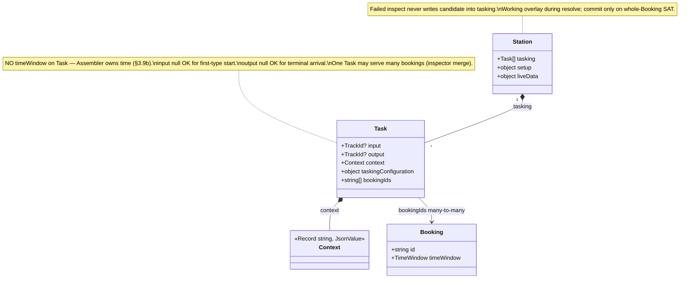
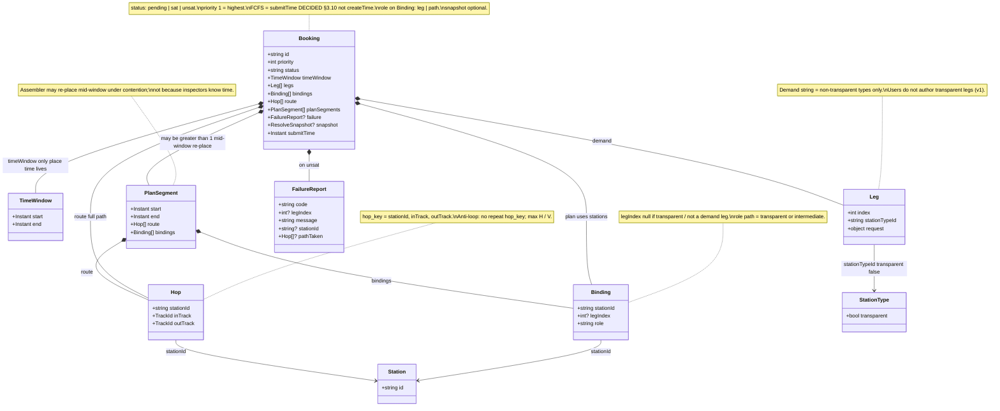
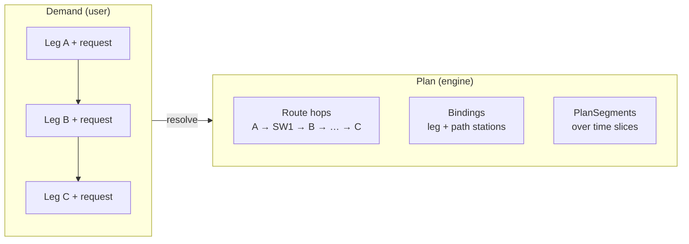
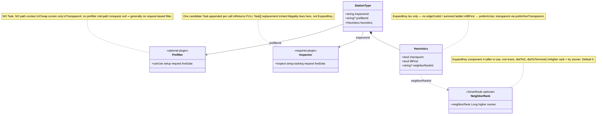
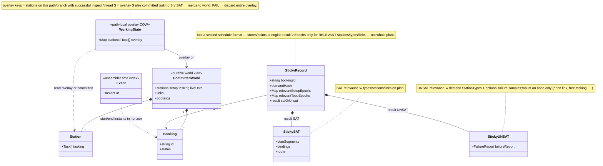
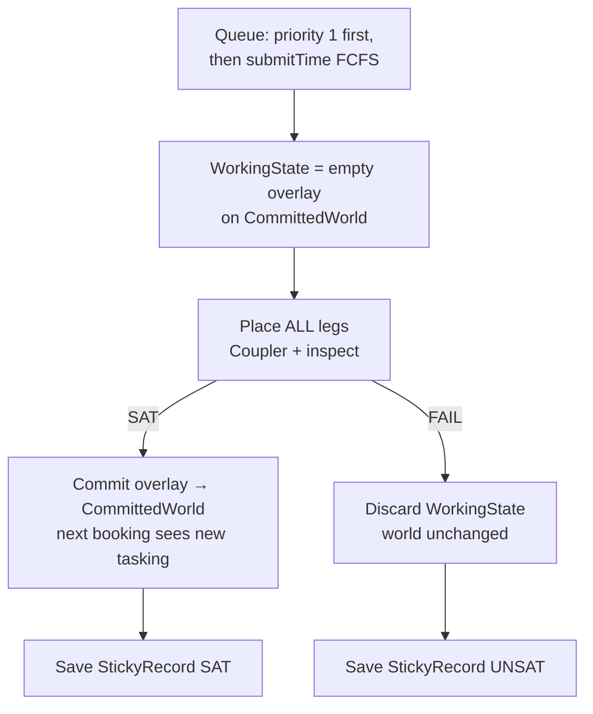

# Trackplan — Entity diagrams

**Source of truth:** [BUILD_SPEC.md](./BUILD_SPEC.md) §1, §3 (especially §3.0–§3.10), §8.0.  
**Purpose:** class / relationship views of the **Station model** for humans and implementers.  
**Rule:** fields and edges match BUILD_SPEC only. Optional / **OPEN** items are labeled on the diagrams.

---

## Vocabulary bridge (old → new)

| Older / legacy wording | Canonical (Station model) |
|------------------------|---------------------------|
| Class / ResourceType | **StationType** |
| Car / Asset | **Station** |
| Yard | **transparent** StationType (no Yard entity) |
| Port | **Track** (`TrackId` + side in/out) |
| Cable | **Link** (OUT track → IN track) |
| config / claims | **Tasking** / **Task** |
| Consist (old project name) | **Trackplan** |
| consist display / plan path | **Route** (`Hop[]`) + **bindings** |

Also: **Assembler** (outer: legs, sticky, commit) · **Coupler** (inner: multi-sink path + **ExpandKey frontier** + inspect on the fabric).

---

## 1. Catalog vs instance

Catalog types define schemas, track shapes, and plugin ids. Instances hold values and live assignment truth.



### How to read this

- **StationType** is catalog; **Station** is a deployed instance of that type.
- Schemas live on the type; **setup / tasking / liveData** values live on the station.
- `inspectorId` is required (code registry). `prefilterId` may be **null** (optional cheap screen).
- `transparent` stations are still real Stations on the fabric; they are only omitted from **demand** legs.
- Type track lists + **legalPairs** are capability; concurrent legality is **Inspector**, not only `legalPairs`.

---

## 2. Fabric topology

Physical graph: stations expose named IN/OUT tracks; **Links** wire an OUT to an IN.



**Traversal sketch (not a class diagram):**



### How to read this

- A **Link** always runs **from OUT → to IN** (never the reverse as a single Link).
- Track identity is a string **TrackId** scoped by station + side; type lists all possible tracks.
- `Link.online = false` or `Station.online = false` (CLOSED) removes that edge/node from Coupler search.
- Topology (Links / online) feeds **Oracle++** (next type, non-transparent chain, terminal, hop `h`); tasking does **not** rebuild Oracle++.

---

## 3. Tasking

Each **Station** holds `tasking: Task[]` — live / planned-live assignment source of truth. Time is **not** on Task.



### How to read this

- Users author **requests** on legs, not Tasks. Coupler proposes a candidate Task; **Inspector** returns a **full** `Task[]` (replacement list).
- **Context** is per-Task path facts, seeded from the previous hop and extended by the inspector.
- `request` material is copied into `taskingConfiguration` **and** passed to `inspect` (BUILD_SPEC option B).
- Cancel / remove SAT booking: drop `bookingId` from Tasks; drop Tasks whose `bookingIds` becomes empty.

---

## 4. Booking: demand vs plan

Demand is ordered non-transparent **Legs**. After resolve, the plan is **bindings**, **route** (`Hop[]`), and optional multi-slice **planSegments**.



**Demand vs plan (conceptual):**



### How to read this

- **Legs** = what the user asks for (types + requests). Transparent types never appear as demand legs.
- **Route** = full hop path including transparent stations (user-visible plan string after claim).
- **Bindings** mark every Station on the plan (`leg` vs `path`).
- **timeWindow** is the only time on the Booking demand; **planSegments** hold time-sliced plan pieces after resolve.
- **submitTime** orders FCFS after priority; create-then-submit is allowed.

---

## 5. Engine plugins (Prefilter, Inspector, NeighborRank / ExpandKey)

Plugins attach by id on **StationType**. Prefilter is optional; Inspector is required. Coupler ranking uses **ExpandKey** lexicographic order (BUILD_SPEC §3.7b); **NeighborRank** is ExpandKey component 4 (SmartNode).



**Call shape (inputs only):**

| Plugin | Reads | Does not read |
|--------|--------|----------------|
| Prefilter | setup, request, liveData | Task, context, path |
| Inspector | setup, tasking+candidate, request, liveData | Assembler time windows |
| ExpandKey | fill-first, non-trans, distToG, distToTerminal, NeighborRank, names | Hard fail (use Inspector) |
| NeighborRank | neighbor tasking/setup/liveData, candidate | ExpandKey component 4 only |

### How to read this

- Assembler runs **Prefilter** to build the multi-sink goal pool; Coupler **inspects** at goals (and every transparent visit) **inside one multi-sink frontier** — not “when a target is peeled.”
- Ranking: **ExpandKey** lex order (§3.7b) — not summed edgeCost / not `f=g+h`.
- Frontier pop is ExpandKey-dominated (`(g, ExpandKey…)`); Oracle++ distances live **inside** ExpandKey (components 2–3), not as a competing frontier `h` / `f=g+h`.
- New ExpandKey columns only by product decision (order changes paths).

---

## 6. Runtime world + sticky

**CommittedWorld** is durable truth. One booking attempt uses a path-local **WorkingState** overlay. **StickyRecord** caches SAT/UNSAT under relevance-scoped epochs.



**Commit lifecycle:**



### How to read this

- Never hold many bookings uncommitted: **whole-Booking commit only**, then the next booking in the queue.
- Overlay is **path-local** (stations actually walked and accepted), not every switch in the plant.
- Sticky hit ⇒ skip Coupler and return cached plan / FailureReport when demand hash + **relevant** epochs still match.
- **liveData** does not auto re-queue; Inspector jar changes imply cold restart (no sticky bust story in v1).

---

## 7. Assembler ↔ Coupler collaboration

Outer Assembler owns legs, prefilter, **Oracle++** goal construction, checkpoints, sticky, and commit. Inner Coupler owns **multi-sink ExpandKey frontier** + inspect at goal (**DECIDED Option A** — BUILD_SPEC §3.9d C2 / §3.7b). Pivot history: [COUPLER_OPTION_A_VS_B.md](./COUPLER_OPTION_A_VS_B.md).

```mermaid
sequenceDiagram
  participant Sticky as Sticky cache
  participant Asm as Assembler
  participant Pref as Prefilter
  participant Oracle as Oracle++
  participant Cpl as Coupler
  participant Insp as Inspector
  participant World as CommittedWorld

  Asm->>Sticky: SAT/UNSAT hit for booking+world?
  alt sticky hit
    Sticky-->>Asm: cached plan or FailureReport
  else miss
    Asm->>Asm: WorkingState = empty overlay on World
    loop each demand leg non-transparent
      Asm->>Pref: canUse setup, request, liveData
      Pref-->>Asm: candidate pool C
      Asm->>Oracle: filter sinks (next type + chain + terminal)
      Asm->>Asm: agenda = sortByExpandKey(goals)
      Asm->>Cpl: couple tail or S0, goals=agenda, working, request
      loop multi-sink ExpandKey frontier until first-fit or exhaust
        Cpl->>Cpl: expand Links + legalPairs ordered by ExpandKey
        Cpl->>Insp: inspect setup, tasking+candidate, request, liveData
        alt inspect OK
          Insp-->>Cpl: full Task[]
          Cpl-->>Asm: path + Task[] + target; stop this segment
          Note over Asm: remaining agenda → alts for later-leg fail only
          Note over Asm: checkpoint previous type only after this leg succeeds
        else inspect fail
          Insp-->>Cpl: Failure
          Note over Cpl: continue same frontier — do NOT return to Assembler
        end
      end
      alt couple returned null
        Asm->>Asm: optional inter-leg backtrack with prior alts else discard; UNSAT
      end
    end
    alt all legs OK
      Asm->>World: commit WorkingState
      Asm->>Sticky: save SAT planSegments, route, bindings
    else fail
      Asm->>Sticky: save UNSAT FailureReport
    end
  end
```

**Responsibility split:**

```mermaid
flowchart LR
  subgraph Assembler
    A1[Legs + queue priority]
    A2[Prefilter pool]
    A3[Agenda goals + inter-leg alts]
    A4[Checkpoint types]
    A5[Sticky + whole-booking commit]
    A6[Time events / planSegments]
  end
  subgraph Coupler
    C1[Virtual S0 first leg]
    C2[Multi-sink path on Links]
    C3[ExpandKey frontier]
    C4[Inspect at goal in frontier]
    C5[Candidate Task in/out/context]
  end
  Assembler -->|"one multi-sink couple() per segment attempt"| Coupler
  Coupler -->|"path + inspect-OK Task[] (first-fit)"| Assembler
```



### How to read this

- **First leg** still uses Coupler: virtual source **S0 → candidates** (no Link into entry stations; inputs unused on first type).
- **Last / terminal** leg: success on arrival (input set, output often null); outs optional once last type is tasked.
- Assembler does **not** expand every track; Coupler does **not** own multi-booking queue or sticky.
- Wrong (DECIDED void): first leg = Inspector-only bind with no Coupler; Option B peel as v1 contract.
- **DECIDED:** multi-sink `couple(goals=…)` (Option A). Oracle++ drops sinks that cannot reach terminal / later non-transparent types.

---

## Cross-reference map

| Diagram | BUILD_SPEC |
|---------|------------|
| 1 Catalog vs instance | §3.0, §3.2, §3.3 |
| 2 Fabric topology | §3.4, §3.5, Oracle in §3.7 |
| 3 Tasking | §3.6, §4 context growth |
| 4 Booking demand vs plan | §3.8, §3.9b PlanSegment |
| 5 Engine plugins | §3.7, §3.7b |
| 6 Runtime + sticky | §3.9c, §3.10 |
| 7 Assembler ↔ Coupler | §8.0, §8.1, §3.9d |

For product thesis and non-goals, see [BUILD_SPEC.md](./BUILD_SPEC.md) §1–§2. For interactive walkthroughs, see [booking-assembler-design.html](./booking-assembler-design.html).
